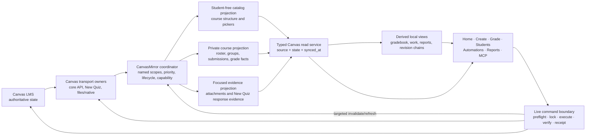

# CanvasMirror to 1.0 beta: the project information spine

Status: **grand vision and migration authority; not an execution brief**

Target: **Canvas Expert 1.0 beta**

As of: **2026-07-18**

Audience: the senior developer who will turn this program into bounded implementation
briefs for one executor at a time

**Execution routing rule:** this document is senior design authority, not executor
prerequisite reading. Never assign or read it wholesale for an implementation slice. The
active handoff must cite only the exact numbered sections needed; the executor reads those
sections and no others.

This document defines the destination, invariants, migration order, and release gates for
making CanvasMirror the essential information spine of Canvas Expert. It is intentionally
larger than an ordinary handoff. A senior developer should use it to make current, exact
slice specifications; it must not be handed directly to a weaker implementation agent as
permission to redesign the repository.

`AGENTS.md` remains authoritative for safety, execution, testing, and branch policy.
`docs/mirror.md` describes the mirror that exists today. This document describes the target
state. When the target becomes current behavior, the implementation batch must update the
current contract and module maps in the same change.

## Reading map (senior routing only)

- Sections 1–5 lock the product decision, evidence, existing foundation, and design laws.
- Sections 6–10 define the current architecture, projection/read contracts, coordinator,
  and deletion/change semantics.
- Sections 11–15 map every product surface and Canvas endpoint family, then lock Gradebook,
  write-safety, and privacy boundaries.
- Section 16 defines the performance targets that remain the bar for the live run.
- Sections 19–24 provide the test/benchmark matrix, the pending live-run checklist, known
  open seams, non-goals, current insertion points, and final north star.

---

## 1. Executive decision

By 1.0 beta, CanvasMirror is the default read plane for Canvas Expert.

That does **not** mean putting a transparent cache in front of every HTTP request, copying
all of Canvas to disk, or allowing cached facts to authorize a write. It means:

- routine course information is acquired once, normalized into narrow local projections,
  and reused by every teacher-facing consumer;
- every read declares its freshness need instead of silently choosing between disk and
  Canvas;
- course lifecycle and per-scope capability are understood, so a concluded or restricted
  course cannot waste minutes repeating known-failing requests;
- teacher focus causes a named, bounded refresh, never an accidental whole-course sync;
- Canvas mutations retain live preflight, idempotency, verification, and receipts;
- every successful mutation invalidates or refreshes only the local scopes it changed;
- pages, files, discussions, and other Canvas objects are mirrored only when a real
  consumer justifies their privacy and performance cost.

“CanvasMirror” therefore becomes the logical subsystem that coordinates a family of
projections. The existing student-free Course Catalog, private roster/submission mirror,
and focused evidence store remain distinct storage and privacy domains. They sit behind one
coordinator and one typed read boundary. They do not need to be collapsed into one physical
directory or one giant schema.

Canvas remains the system of record. CanvasMirror becomes the system through which Canvas
Expert understands that record.

---

## 2. What 1.0 beta must feel like

For the teacher, the transition is successful when:

1. Canvas Expert opens immediately from last-good local state. Background synchronization
   is visible but is not a launch barrier.
2. Moving among Home, Create, Grade, Students, Automations, and reports does not repeatedly
   download the same assignments, roster, or submissions.
3. A normal no-change refresh is short and quiet. A concluded course with unavailable New
   Quiz endpoints does not tax every heartbeat.
4. Selecting one assignment refreshes that assignment's grading context. It does not
   trigger unrelated New Quiz metadata, every attachment, or every course.
5. New, changed, and deleted Canvas objects are reflected predictably. A page remains absent
   only because page content is explicitly outside the mirrored contract, not because the
   system failed silently.
6. Every surface states whether data is current, stale, incomplete, unavailable, or live.
   The teacher never has to guess whether a gradebook is old.
7. Read-only work remains useful during a Canvas outage. Write controls remain conservative
   and refuse to treat local state as a live preflight.
8. A CanvasExpert write appears in the local read model promptly through targeted
   reconciliation, without waiting for the next global heartbeat.
9. Sync status and performance are understandable without exposing student names, content,
   tokens, signed URLs, or private filesystem paths.

For the codebase, the transition is successful when:

- UI routes and feature modules do not construct routine Canvas GET paths;
- one acquisition owner exists for each mirrored scope;
- consumers request typed facts, not endpoint-shaped dictionaries;
- live transport remains explicit for diagnostics, focused evidence, preflight, writes,
  and post-write verification;
- direct `requests` usage is confined to named specialized transports;
- a repository-level boundary check prevents new bypasses;
- the old mirror shims can be retired after consumers converge on the shared read service.

---

## 3. Why this is now a release-level concern

CanvasMirror already proves the value of local reads. The remaining problem is structural:
the application still has multiple acquisition owners, multiple freshness stories, and
several endpoint call sites that bypass the mirror entirely.

---

## 4. Existing foundation: preserve it, do not rebuild it

The 1.0-beta program begins from substantial completed work. The durable component
inventory the migration must preserve:

- **CanvasMirror v1** — versioned private course storage (students, sections, assignments,
  submissions, attempts, grades, status, comments) with full/delta/roster passes,
  last-good behavior, watermarks, mirror-first gradebook snapshots, and MCP reads.
- **CanvasMirror New Quizzes v2** — continuous NQ metadata/item catalogs, focused response
  snapshots, append-preserving attempts, URL/credential scrubbing; grading writes stay live.
- **CanvasMirror v3 read migration** — mirror-first work-discovery providers, display reads,
  and curve lists; comments persisted on full passes; separately hardened pseudonym vault.
- **Course Catalog v1** — student-data-free assignment/module projection with strict
  allowlists, rich descriptions/rubric data/module outlines, atomic writes, previous
  snapshots, corruption recovery, and OneDrive conflict warnings.
- **Existing write safety** — operation-ledger adapters own most content/gradebook
  mutations; PowerGrader keeps explicit review, live preflight, idempotency, and receipts.
  Its live-course New Quiz item-finalization lane uses Canvas's first-party short-lived
  signed grader transport (preflight freeze, result-version drift detection, verification,
  receipts, fail-closed SpeedGrader fallback); active/current instructor enrollment is
  required and restricted courses can return `403`; NQ scheduled/late-catch-up/interactive
  auto-posting remain unavailable.

The migration must converge these pieces. It must not replace them with a database, a new
job platform, a raw-response cache, or a second write system.

---

## 5. Non-negotiable design laws

These are the architectural decisions future briefs must inherit.

### 5.1 Canvas is truth; projections are disposable

Every mirrored Canvas fact can be deleted and rebuilt. A projection may preserve attempt
history observed over time, but it never becomes a competing authority. Corrupt projection
files are treated as absent or recovered from a validated previous snapshot.

### 5.2 CanvasMirror is not a universal HTTP proxy

Do not intercept arbitrary GET strings and call that architecture. Endpoint-matching shims
were useful migration seams; they are not the final API. Consumers ask for typed scopes or
views. Acquisition owners know the Canvas endpoints.

### 5.3 One acquisition may feed multiple projections

Assignments are currently fetched for both the private mirror and Course Catalog. In the
target state, one in-memory acquisition can emit:

- a slim private/read-compatible assignment index;
- a rich, student-free catalog assignment record;
- invalidation signals for derived work and grading views.

Raw Canvas responses are not written to disk. Each projection validates and commits its own
allowlisted shape independently.

### 5.4 Privacy boundaries stay physical and explicit

Student-free navigation data, private student state, focused binary evidence, identity
vaults, and operation receipts are not merged for convenience. A consumer receives only
the projection it needs.

### 5.5 Freshness is per course and per scope

There is no honest global “synced” boolean. Roster can be current while New Quiz responses
are unavailable; assignments can be current while comments are stale. Every read result
carries state, source, and time.

### 5.6 Read intent is explicit

A display read, focused grading refresh, and write preflight are different operations. The
caller declares which one it needs. A generic fallback helper must not silently upgrade a
local display read into a multi-minute global fetch.

### 5.7 Reads that can cause a write remain live at the decision boundary

Local data may populate pickers, dashboards, and provisional previews. Before any Canvas
mutation, the owning adapter obtains authoritative live state under its existing lock,
drift, idempotency, and receipt rules. The mirror never authorizes a grade, comment,
extension, group change, late-policy change, or content mutation.

### 5.8 Foreground teacher work outranks background freshness

Create must not wait for unrelated submission synchronization. A focused assignment refresh
must outrank a concluded-course maintenance pass. Background work yields or pauses while a
write preflight is active.

### 5.9 Deletion is a first-class change

A complete authoritative collection response defines membership. Removed assignments,
students, groups, comments, and New Quiz records must stop appearing in queries immediately
after that complete response commits. Cleanup may follow, but stale orphan files cannot
remain logically visible.

### 5.10 Failure retains last-good data but never claims success

Transport failure, authorization failure, invalid records, partial pagination, and storage
failure produce different sanitized states. None erases last-good data. None advances a
watermark. None is mislabeled current.

### 5.11 Background synchronization is read-only

Normal GETs and the narrowly classified New Quiz report-generation read path are permitted.
No heartbeat may issue a grade, comment, content, membership, policy, or file mutation.

### 5.12 Performance is part of correctness

A scope that retries 96 known-forbidden calls every 15 minutes is malfunctioning even if it
eventually returns the right accessible data. Request count, bytes, wall time, failure class,
and queue delay are acceptance evidence.

---

## 6. Current architecture

The arrows are intentionally asymmetric:

- the mirror receives facts from Canvas;
- UI and reports receive facts from typed local reads;
- commands bypass the mirror for authority;
- successful commands teach the mirror what to refresh;
- derived views never write Canvas directly.

### 6.1 Logical components

**Canvas transport owners** perform HTTP, pagination, rate-limit handling, credential
scrubbing, and sanitized timing. The normal core client remains separate from specialized
New Quiz native/report and file-transfer transports.

**CanvasMirror coordinator** accepts named scope requests, understands dependencies,
coalesces duplicates, prioritizes teacher focus, and applies course lifecycle/capability
policy.

**Projection writers** normalize an acquisition into one strict storage contract. They do
not call Canvas and do not know UI routes.

**Typed read service** is the only routine information boundary for consumers. It returns
data plus provenance and freshness. It may request a bounded refresh according to explicit
policy.

**Derived views** compute reusable teacher concepts—gradebook snapshots, attention rows,
grading debt, revision chains, report facts—from projections. They do not become a second
Canvas cache.

**Live command boundary** owns every mutation and its authoritative reads. The operation
ledger and PowerGrader remain the principal implementations.

---

## 7. Projection model and 1.0-beta scope boundary

The following table is the target scope decision. “Required” means a concrete current
consumer justifies the scope before 1.0 beta. “Focused” means acquire only in response to a
teacher-selected object or write workflow. “Deferred” means do not add merely for symmetry.

| Canvas information | 1.0-beta treatment | Projection / owner | Primary consumers | Important boundary |
|---|---|---|---|---|
| Configured course identity, name, Canvas lifecycle, enrollment access | Required | Student-free course context | All course pickers, scheduler, status | Configured does not mean current |
| Per-course/per-scope capability | Required | Student-free capability envelope | Coordinator, diagnostics | Record restricted/unsupported and cooldown |
| Assignments and quiz classification | Required; shared acquisition | Catalog + private slim projection | Home, Create, Gradebook, PowerGrader, reports, MCP | One fetch, separate allowlists |
| Modules and module-item outlines | Required | Student-free catalog | Create, Course Info, PowerGrader | No page bodies implied |
| Assignment-group definitions and weights | Required | Student-free gradebook/structure scope | Create pickers, Gradebook, reports | Execution resolves live before writes |
| Attached assignment rubric data | Focused when scoring needs it | Assignment/PowerGrader focused evidence | PowerGrader | No separate Create picker or rubric index |
| Canvas late policy and relevant gradebook course settings | Required | Student-free gradebook-config scope | Gradebook display and operation preparation | Apply/verify remains live |
| Canvas grading periods | Conditional required | Student-free gradebook-config scope | Gradebook only when course uses them | Distinct from local academic calendars |
| Students and sections | Required; already present | Private roster projection | Students, Gradebook, reports, Work, MCP | No email/avatar by default |
| Group categories, groups, memberships | Required | Private group projection | Roster, Course Info, Work warnings, differentiated Create pickers | Mutations and final verification live |
| Current submission row, score, grade, workflow/status | Required; already present | Private per-assignment submissions | Gradebook, Work, reports, PowerGrader text path, MCP | IDs remain normalized consistently |
| Attempt history and text-entry bodies | Required; already present | Private per-assignment submissions | PowerGrader, revision views | Preserve observed attempts; no invented backfill |
| Personalized due facts (`cached_due_date`, late seconds/override where returned) | Required | Private submission projection | Student Reports, late-work display, Gradebook | Do not replace focused override preflight |
| Submission comments and staff-role facts | Required | Private submission projection / comment reconcile | Home attention, grading debt, reports | Comment-only changes need an explicit freshness policy |
| New Quiz metadata and item catalog | Required for accessible scopes; already present | Private New Quiz metadata projection | PowerGrader | Restricted courses must not fan out failures |
| New Quiz student responses | Focused; already present | Private per-assignment/student response snapshots | PowerGrader | Never a write preflight |
| Attachment names and evidence completeness | Required as metadata | Private submission/evidence records | PowerGrader, reports | Signed URLs never persist |
| Attachment/file bytes | Focused only | Canonical private evidence owner | PowerGrader, explicit open/download, portfolios | Never background-prefetch all files |
| Assignment overrides | Focused/live | Command or focused report owner | Extensions, differentiation, write preflight | Do not globally mirror override trees for 1.0 beta |
| Page/module item stubs | Required through modules | Student-free catalog | Course structure/navigation | Title/type/content ID only |
| Page bodies | Required since 2026-08-01 | Student-free catalog `pages` scope | `get_course_pages` MCP course context, web UI course-catalog route | Normalized plain text only; every URL rewritten to `[link]` |
| Classic Quiz questions and detailed responses | Live/focused or Canvas-native | PowerGrader/SpeedGrader boundary | Grading | No broad mirror in 1.0 beta |
| Teacher/TA/observer directory | Deferred/minimal classification only | None unless a current consumer proves need | Comment authorship edge cases | Do not mirror emails for convenience |
| Student email and avatars | Live explicit action or remove consumer | No default persistence | Course Info edge case | Privacy cost exceeds routine value |
| Discussions and announcements | Deferred | None | No current essential consumer | Not mirrored for completeness |
| Calendar events | Deferred | None | No current essential consumer | Local academic calendar remains separate |
| Course navigation and general course settings | Deferred except named gradebook fields | None / gradebook-config allowlist | Specific future consumer only | Avoid raw course-object storage |
| Grade-change audit history | Live/receipt-based | Operation receipts, not mirror | Reconciliation/support | Current state is not an audit log |
| Operation plans, receipts, pseudonym vault | Outside CanvasMirror | Existing private owners | Writes, AI safety | Irreplaceable local state is not disposable mirror data |

### 7.1 Why page bodies were deferred, and what met the bar

Page bodies were originally deferred. The project can create, reconcile, and place pages
without using page bodies as routine read context; those operations require live baselines
and verification anyway, and module item stubs already answer the navigation question: what
page is placed where? The bar for adding a scope was a concrete product needing local course
search, course-context generation, content audits, or offline page review, built student-free,
persisting normalized plain text plus stable identity/timestamps, and never storing raw HTML,
signed URLs, or arbitrary page fields. Pages existing in Canvas was explicitly not reason
enough on its own.

**That bar was met and the scope was added on 2026-08-01.** The named consumer is AI course
context: the `get_course_pages` MCP tool serves page text to an assistant, with `full_text`
for complete bodies. The v3 catalog carries a `pages` scope alongside assignments, modules,
and assignment groups, acquired with `include[]=body` and normalized by `course_catalog`
before anything is written to disk. Each of the original conditions holds in the code:
records carry no student fields; `_page_text` parses HTML down to plain text and refuses
control characters; identity and freshness are the Canvas page id and `updated_at`; raw HTML
is never stored; every URL is rewritten to `[link]`, so a signed URL cannot survive
normalization; and the six-key `PAGE_KEYS` allowlist is enforced by `_require_exact_keys`, so
arbitrary Canvas page fields cannot leak in.

The `pages` scope is invalidatable like any other, and the operation ledger marks it stale
after a page push. See `docs/reference/mutation-reconciliation-map.md` family 2. The related
non-goal in section 22 is unchanged and still holds: it forbids mirroring page bodies
*without* a named course-search/context consumer, and this scope has one.

### 7.2 Course Catalog remains separate on disk

The student-free Course Catalog is a successful privacy boundary. The target is shared
acquisition and a shared read/coordinator API, not forced storage consolidation. Existing
paths should remain compatible unless a later contract migration has an immediate payoff.

### 7.3 Focused evidence remains a separate owner

Binary attachments and New Quiz native evidence have different size, authorization,
freshness, and renderer constraints from metadata. CanvasMirror coordinates their status
and exposes their completeness; it does not turn the heartbeat into a course-wide download
job.

### 7.4 Schema evolution is rebuild-first and last-good-safe

Private mirror projections are disposable, but a version transition must not force the
teacher to stare at an empty product during a long rebuild. When a scope needs a new schema:

1. leave the validated old projection readable under its old contract;
2. mark the new scope unavailable/rebuilding rather than pretending the old shape contains
   new fields;
3. acquire and validate the new version beside the old one;
4. atomically make the new version canonical only after complete success;
5. retain or remove old disposable versions according to a documented compatibility window;
6. never migrate private projection data by sending it outside the workspace.

Additive fields may use a bounded compatibility reader when validation permits, but “just
patch every old JSON file in place” is not the default.

### 7.5 Shared acquisition does not claim a Canvas transaction

One assignments fetch may emit multiple projections with a common acquisition generation
and observation time. Each projection still validates and commits independently. If the
catalog commit succeeds and the private projection commit fails, the two scopes report
their real independent state; the system does not claim an impossible cross-file or Canvas
transaction. A later retry reuses or reacquires according to the versioned contract.

---

## 8. The typed read contract

Reads are typed by scope and intent, not Canvas URL shape. Every result carries an envelope
(state, capability, source, freshness timestamps, generation) under a `records` payload key.
Read intents span local-display, refresh-if-stale, focused-current, authoritative-live,
explicit-diagnostic, and offline. State (`current`/`stale`/`incomplete`/`unavailable`) and
capability (`supported`/`restricted`/`unsupported`/`unknown`) are separate axes; a restricted
scope can still hold stale last-good data.

This contract is now formalized and shipped. See
`docs/contracts/canvas-read-spine-contract.md` for the authoritative envelope schema, the
per-intent source rules, and the versioning constraints (including the locked `records` key
and the Course Catalog unknown-field rejection rule).

---

## 9. Coordinator and scheduling model

The coordinator replaces monolithic `sync_now(course_id)` with named minimum scopes
(course context, structure, roster, groups, submission delta, focused assignment, comment
reconcile, New Quiz metadata/response, evidence) planned into orchestrations. It enforces a
priority order (live preflight/verify > targeted post-write reconcile > teacher focus >
manual refresh > current-course maintenance > concluded-course true-up), coalesces duplicate
requests under a fixed small concurrency bound, and applies course lifecycle and per-scope
capability policy (a capability circuit backstops durable restrictions; lifecycle predicts,
one bounded probe confirms). The app shell renders from last-good state with no global
readiness barrier.

This model is now formalized and shipped. See
`docs/contracts/canvasmirror-coordinator-contract.md` for the authoritative scope names,
priority/lifecycle/capability policy, cadence parameters, and pagination/rate-limit rules.

---

## 10. Correct change and deletion semantics

### 10.1 A complete collection defines membership

For assignments, students, modules, groups, and similar collections, the acquisition layer
must preserve evidence that all pages completed and all accepted records validated. Only
then may the new ID set replace the old set.

A fully successful, fully paginated empty response can be authoritative. A timeout, partial
pagination, invalid root, or rejected record cannot.

---

## 11. Tool-to-Canvas routing

The product map the senior should preserve while writing briefs. The module maps under
`docs/reference/` own the per-route implementation detail; this table owns the durable
routing law.

| Surface | Local spine | Canvas live / focused | After write |
|---|---|---|---|
| Home / Work | course context, assignments, submissions, comments, roster, groups, derived attention/work rows | bounded comment reconcile on focus; explicit retry for a failed scope | actions enter the owning operation/PowerGrader path; no writes from discovery |
| Create / Course Expert | course context, modules, module items, assignment groups, capability | operation-ledger baseline, collision/drift checks, create/update, file upload, module placement, overrides, verification | refresh exact structure scopes (assignment → both projections; placement → modules) |
| Course Info | course context, students, sections, groups/memberships, modules, assignments | explicit course-list refresh; any non-persisted field (e.g. email) only if that feature remains | targeted refresh of the touched scope |
| Grade / PowerGrader | picker data, rubric context, text-entry rows, attempts, comment context, cached NQ metadata/response snapshots | exact assignment state/submissions when the delta cannot satisfy; evidence; Student Analysis report; native NQ evidence; late-catch-up polling; grade/comment/NQ-finalization writes | refresh exact submission/student or NQ response scope, then invalidate grading-debt/attention views; never whole-course `sync_now`; never unrelated NQ metadata |
| Gradebook Expert | students, assignments, submissions, personalized due facts, assignment groups/weights, late-policy display, grading settings, optional grading periods, derived snapshots | curve baselines feeding a write, sweep final recompute, extensions/overrides, late-policy apply/verify, every grade/status mutation | refresh only affected gradebook-config/assignment/submission/due-fact scopes |
| Students / Roster | students, sections, group categories, groups, memberships, aliases, tiers, extra-time settings | group creation, membership add/remove, final verification | targeted group/membership refresh; invalidate roster-warning views |
| Student Reports / portfolios | roster identity, assignments, standing, text bodies, attempts, comments, group names, due facts, derived report facts | attachment bytes and in-memory signed URLs; any field absent from a deliberate projection | emit a private source/freshness manifest; never copy signed URLs into reports |
| Automations / Routines | detection/count/report-only routines whose scope is fresh enough | final compute/preflight and execute of any mutating routine | targeted refresh of scopes the routine mutated |
| MCP | roster, assignments, submissions, grades/status, allowed derived views (local pseudonymization + source labeling) | bounded, explicitly authorized fallback only when no projection exists; never an accidental all-course first sync | newly mirrored fields need an outbound allowlist + scrub review before entering payloads |
| Settings / Connections | course context, last-known lifecycle/capability, sync state, sanitized diagnostics | connection test, `/users/self`, course discovery, capability diagnostic | course discovery teaches the course-context scope; status pages read local envelopes |
| Operation Ledger | course/module/assignment-group pickers | prepare baselines, execute, drift detection, reconcile, verify (live even when local equivalents exist) | each adapter declares the scopes it invalidates/refreshes; no shadow cache |
| AI Expert | local only — no Canvas read requirement | — | not routed through CanvasMirror for symmetry |
| Diagnostics / support | sanitized local metrics: scope, state, request counts, durations, bytes, retry/circuit state, stable error code | live health tests are explicit user actions | support bundles exclude student rows, response bodies, tokens, signed URLs, and private paths |

Two durable safety notes survive the table:

- **Pickers never prove existence.** Local pickers reduce latency but never prove a target
  still exists at execution time; every mutation resolves authoritative live state first.
- **Sweep-apply release blocker.** The direct `/api/sweep/apply` path must recompute live at
  apply time or route through the operation-ledger sweep adapter; it must never accept
  client-submitted preview entries as the authoritative write set.

---

## 12. Canvas endpoint-family ownership

The senior should re-run the repository call-site inventory before each migration batch.
This table states the end-state owner, not permission to change every caller at once.

| Endpoint family | Routine read owner | Live/focused owner | 1.0-beta rule |
|---|---|---|---|
| `/users/self`, available courses | None | Settings/Connections transport | Always explicit live diagnostics/discovery |
| Course identity/state | Course-context scope | Settings refresh | Persist lifecycle/capability context |
| Assignments collection | Shared structure acquisition | Operation adapters for preflight | Emit catalog + private projections once |
| Assignment detail | Local assignment view when display-only | PowerGrader/operation focused preflight | Intent decides source |
| Modules/items | Catalog structure acquisition | Operation adapters for placement/reconcile | Pickers local, writes live |
| Assignment groups | Structure/gradebook-config scope | Operation resolution/preflight | Picker/report local, execution live |
| Rubrics | Student-free assignment rubric facts | Focused assignment/PowerGrader reads | Add only fields consumed by current scoring flow |
| Users/students/sections | Private roster scope | Focused explicit field request | Routine roster local |
| Group categories/groups/memberships | Private groups scope | Roster and operation adapters | Remove N+1 display reads |
| Course submissions | Private submission delta/reconcile | Focused assignment and write preflight | No duplicate surface fetches |
| Assignment submissions | Named focused scope | PowerGrader/grade command | Never imply whole-course sync |
| Late policy/course grading config | Gradebook-config scope | Late-policy adapter | Display local, mutation live |
| Assignment overrides | None globally | Extension/differentiation focused owner | Remain live/focused for beta |
| Core quizzes / Classic Quiz details | None broadly | Focused grading/content owner | Do not mirror for completeness |
| New Quiz metadata/items | New Quiz metadata scope | Quiz operation preflight | Capability circuit required |
| New Quiz reports/responses | Focused response scope | PowerGrader report owner | Report generation never global heartbeat work |
| Native New Quiz launch/result/item calls | None | Specialized PowerGrader grader/evidence owner | Credentials and signed URLs memory-only |
| Files/attachments | Metadata in projections | Focused evidence/upload owner | No background binary sweep |
| Pages | Module stubs plus catalog `pages` scope | Page operation adapter; catalog owns the projection | Plain-text bodies only; no raw HTML or URLs |
| Discussions/announcements/events | None | Future named consumer only | Out of 1.0-beta scope |

Direct `requests.Session` usage should remain only where the shared core client cannot own
the protocol: signed/native New Quiz transport, streaming/binary evidence, explicit
diagnostics, or similarly documented cases. Student Reports and portfolios are not special
protocols; their routine metadata calls should move behind the read service.

---

## 13. Gradebook as a first-class mirror consumer

Gradebook is where the information-spine idea becomes most valuable and most dangerous.

### 13.1 Separate three kinds of “calendar”

1. **Local academic calendars** are user-provided workspace CSVs used for school-day math
   and locally named grading periods. They are not Canvas data and remain owned by config.
2. **Canvas grading periods** are Canvas course/account facts. Mirror them only for a course
   that uses them and a Gradebook feature that consumes them.
3. **Assignment/student effective due facts** come from assignments, submissions, and
   focused overrides. They are neither of the above.

The current Gradebook “grading periods” UI reads local calendar CSV data. Routing it through
CanvasMirror would be incorrect. Adding Canvas grading-period awareness is a new conditional
feature.

### 13.2 Gradebook configuration scope

The student-free gradebook-config projection should include only fields used by Gradebook:

- late-policy settings;
- assignment-group identity, order, and weights;
- whether weighted groups apply;
- grading-scheme identifiers/settings only where the UI displays or computes with them;
- Canvas grading-period identity/dates only when enabled and consumed;
- a small capability/freshness envelope.

It should not persist raw course settings.

### 13.3 Read-only gradebook views

Grade snapshots, student/assignment pickers, standing, missing/late/excused state, report
inputs, and configuration display come from the local spine. Personalized due fields
(`cached_due_date`/`seconds_late`) belong in the private submission allowlist because reports
consume them.

### 13.4 Write-adjacent gradebook workflows

- **Late policy:** show local last-good policy; prepare/apply/verify live through the
  operation owner; refresh gradebook config after success.
- **Sweep:** a display estimate may use current local facts; apply recomputes authoritative
  assignments, submissions, and students under the operation lock before writing
  `seconds_late_override`.
- **Curves:** list assignments locally; preview may be live when it is presented as the
  exact write plan; apply and revert always reload authoritative scores.
- **Extensions:** list students/assignments locally; read and mutate assignment overrides
  live; refresh affected due facts after success.
- **Extra time:** list students locally; local accommodation settings stay local; any Canvas
  differentiation generated from them preflights live.

There must be no route where a browser-submitted local preview is accepted as the
authoritative write set.

---

## 14. Write safety and targeted reconciliation

### 14.1 The command sequence

Every Canvas mutation follows the same conceptual sequence, even if existing owners use
different internal names:

1. identify exact course/object scope;
2. acquire authoritative live state;
3. evaluate capability, drift, policy, and idempotency;
4. freeze the plan under the appropriate lock;
5. record receipt preflight where required;
6. execute the minimum Canvas mutation;
7. re-fetch and verify authoritative result;
8. finalize receipt;
9. request targeted mirror reconciliation;
10. show success only with honest verification/reconciliation status.

If step 9 fails, the Canvas write can still be successful. The relevant local scope becomes
stale/reconciliation-needed; it must not be silently patched into “current” from an
incomplete response.

### 14.2 Mutation-to-scope map

Every mutation declares the exact scopes it invalidates or refreshes after verified success,
and each operation adapter owns that declaration near its own code rather than in one giant
disconnected registry. The per-mutation mapping is no longer maintained in this document.

The authoritative sources are `docs/reference/mutation-reconciliation-map.md` and the
enforcing test `api/tests/test_canvas_mutation_ownership.py` — **the test is the source of
truth**. Any prose mapping (including in the reconciliation map) is unverified until it
agrees with that test; verify against the test before planning a reconciliation unit.

### 14.3 GET-only enforcement for background work

The ordinary coordinator transport should reject mutation methods by construction. The New
Quiz Student Analysis report creation is a read acquisition with a Canvas-side generated
artifact; it remains a specialized focused path and must never be scheduled across all
quizzes as routine metadata work.

---

## 15. Privacy, FERPA, credentials, and OneDrive

### 15.1 Projection classification

- **Student-free:** course context, assignments, modules, module stubs, assignment groups,
  rubric definitions, gradebook configuration.
- **Private student data:** roster, sections, groups/memberships, submissions, attempts,
  comments, grades, personalized due facts, New Quiz responses.
- **Private evidence:** attachment bytes, media, native New Quiz evidence, generated reports.
- **Irreplaceable private state:** pseudonym vault, teacher settings/aliases, receipts. These
  are not disposable mirror projections.

Each storage contract has exact allowlists and unknown-field rejection. A field's presence
in a Canvas response is never enough reason to persist it.

### 15.2 Credentials and URLs

Tokens, cookies, CSRF values, workflow JWTs, native result tokens, signed launch fields,
signed URLs, authorization headers, and raw transport errors remain memory-only and
content-free in logs. Evidence records store URL-free local relative identity only where
the existing evidence owner permits it.

### 15.3 Operational logging

Metrics may include scope name, lifecycle class, stable error category, status code, request
count, bytes, and duration. They must not include student IDs/names, assignment titles,
submission bodies, comment text, private paths, raw URLs with query strings, or response
bodies.

### 15.4 OneDrive behavior

- Atomic same-directory replacement and validated previous snapshots remain the default.
- Last-good files stay readable during refresh.
- Disposable projection conflicts may warn and rebuild; they are not merged speculatively.
- Canonical private evidence and the identity vault keep their existing stronger ownership
  rules.
- A “rebuild mirror” action resolves only the exact mirror/catalog roots and never deletes
  broader workspace data.

---

## 16. Performance contract for 1.0 beta

Performance gates must be tested on the same three-course profile used for the baseline:
one current configured course and two concluded configured courses, with synthetic or
teacher-authorized private data kept outside the repository.

### 16.1 Release targets

These targets are deliberately environment-relative and should be recorded as median plus
worst observed run, not asserted as universal Canvas guarantees.

| Scenario | 1.0-beta target in the baseline environment |
|---|---|
| Render app and last-good local course context | No Canvas wait; ordinary local read under 1 second |
| Three-course cold build | Median at or below 8 minutes and no more than 300 physical GETs, absent Canvas throttling/outage |
| Three-course no-change warm refresh | Median at or below 30 seconds; no normal run above 60 seconds absent outage |
| Warm request volume | At most 25 physical requests and 5 MiB for the baseline profile |
| Known-restricted New Quiz scope | Zero per-quiz calls during cooldown; one bounded scope probe when eligible |
| Focused text assignment refresh | Only named assignment/course submission scopes; target 15 seconds median |
| Local picker/grade snapshot/roster read | Disk-only and perceptually immediate |
| Post-write reconciliation | Only declared affected scopes; no unrelated course or New Quiz work |

If Canvas itself takes longer, the product must remain responsive, show the scope as
refreshing/stale, and report network time separately. A slow endpoint is not permission to
freeze the whole UI.

### 16.2 Required instrumentation

For every acquisition plan and scope, capture sanitized:

- queue wait and priority;
- logical calls and physical paginated requests;
- HTTP status/error category counts;
- bytes received;
- transport duration;
- normalization/validation duration;
- atomic write duration;
- rows/items accepted, rejected, added, changed, removed, and skipped;
- capability circuit opens/skips/reprobes;
- source and age of consumer reads;
- cancellation/yield due to foreground work.

Metrics should be bounded rotating operational records, not a student-data warehouse.

### 16.3 Performance changes expected to matter

1. Suppress repeated concluded-course New Quiz authorization fan-out.
2. Replace whole delta calls with named scopes for PowerGrader and post-write refresh.
3. Share assignments acquisition between private mirror and Course Catalog.
4. Coalesce duplicate scope requests from Home, routines, MCP, and UI routes.
5. Use fixed small concurrency across independent scope/course work while preserving
   foreground priority and Canvas rate limits.
6. Keep binary evidence and report generation focused.
7. Avoid re-reading and rewriting unchanged projection documents where validation and
   freshness envelopes can be updated safely.

Concurrency alone is not the solution. A parallel storm of forbidden or unnecessary calls
is still incorrect.

---

## 19. Required test and benchmark matrix

All repository fixtures are synthetic. Live tests use teacher-authorized courses and keep
all private output outside the repository.

### 19.1 Projection contract tests

Allowlists/unknown-field rejection, atomic-write/snapshot/corruption/last-good, ID
normalization, complete-vs-partial pagination, empty-vs-failure, membership diffs, orphan
filtering, idempotent overlap, comment omit-vs-empty, per-scope envelopes, and no leaked
credentials/PII — embodied in the shipped projection suites.

### 19.2 Coordinator tests

Scope dependency planning, coalescing, priority order, current-vs-concluded cadence,
capability cooldown/override, rate-limit/retry, cancellation without watermark advance, and
isolated per-scope failure — embodied in the shipped coordinator suites.

### 19.3 Consumer tests

Per migrated surface: zero routine Canvas calls on usable local state, correct
stale/unavailable behavior, source/timestamp reaching the UI, live/local equivalence, no
private-field leakage, and write paths still consulting live transport — embodied in the
shipped consumer suites.

### 19.4 Mutation tests

Authoritative pre-execution reload, drift rejection, idempotency/receipt preflight, ambiguous
verification, exact post-write reconciliation, no repeated write on reconcile failure,
mutation-ineligible background sync, and `/api/sweep/apply` refusing a browser-provided stale
plan — embodied in the shipped mutation suites.

### 19.5 Live benchmark scenarios

Run these against the same configured three-course profile:

1. **Zero state:** empty disposable catalog/mirror roots to all configured course scopes.
2. **No change:** immediate warm refresh.
3. **Structure change:** create, edit, and delete a synthetic assignment; change module
   placement; verify exact diffs and cleanup.
4. **Out-of-scope page change:** create/edit a page body without module change; verify no
   false mirror claim and clear scope explanation.
5. **Submission change:** new submission, resubmission, grade/status change, missing flag
   reconcile, and comment-only change.
6. **New Quiz accessible:** metadata create/edit and focused response acquisition.
7. **New Quiz restricted:** concluded course 401/403 opens a bounded scope circuit and makes
   no per-quiz calls during cooldown.
8. **Focused grading:** open one text assignment and one New Quiz; record exact scope calls.
9. **Post-write:** teacher-authorized benign test write only when explicitly approved;
   verify exact targeted reconciliation.
10. **Network faults:** timeout, connection failure, 429, partial pagination, invalid JSON,
    and recovery.
11. **Offline:** launch and navigate from last-good state; verify write refusal.
12. **Two-machine/OneDrive:** concurrent disposable projection updates, conflict warnings,
    and vault fail-closed behavior.

Record wall time, logical/physical requests, bytes, status/error classes, scope changes,
source/freshness, and any Canvas rate-limit evidence. Never record private response bodies.

### 19.6 Accepted limitations and deferred live-run

**Accepted beta limitation (documented, not a defect):** Per-student override staleness
(Batch 7 unit 03) — the mirror stores no override projection; the only stale surface is
`submissions.cached_due_date` on the Student Report "Due date extended to" line, with live
fallback outside the ~6h freshness window. Low severity; no hook repairs it. See
`docs/reference/mutation-reconciliation-map.md` family 3.

**Deferred to the live start-of-year run** (needs a real 1-current/2-concluded profile with
live students and current New Quizzes; we chose not to build a synthetic Canvas):

1. Benchmark (`tools/canvasmirror_release_benchmark.py --live-readonly`) against the §16
   cold/warm/GET targets.
2. Live state matrices: offline launch + write-refusal, two-machine OneDrive conflict, and
   network-fault recovery — all unit-covered; live confirmation pending.
3. Rendered-route sweep completion (12 routes already clean).

Note: the 2026-07-20 live sync surfaced no code defect — it honestly reported "could not
finish" when an out-of-profile shell course and 503-throttled archived New Quizzes made
complete-collection fetches fail. That is design law 5.10 working (fail-closed), not a bug.

---

## 20. 1.0-beta release checklist

The code-complete acceptance items — read authority, correctness, write safety, privacy,
and maintainability — are done and now stand as regression boundaries. Only the live
start-of-year run remains. These items overlap §19.6 and must be confirmed against real
courses, not synthetic data:

- [ ] Cold and warm benchmark targets in section 16 pass, or an accepted measured beta
  exception is recorded.
- [ ] Known-restricted New Quiz scopes do not fan out during cooldown (live).
- [ ] Focused assignment refresh makes no unrelated scope calls (live).
- [ ] Canvas latency does not freeze unrelated UI (live).
- [ ] Rate-limit, timeout, partial-pagination, corrupt-file, and offline recovery hold (live).
- [ ] Offline launch/navigation from last-good state with write refusal (live).
- [ ] Current-versus-concluded course maintenance behavior differs visibly (live).
- [ ] OneDrive/two-machine conflict behavior retains last-good readable state (live).
- [ ] Rendered-route sweep completes with zero new console errors.

---

## 21. Known issues that should seed the first briefs

These are current, concrete seams discovered during the architecture/performance audit.
They are not speculative feature requests.

1. **Duplicate structure acquisition:** Course Catalog and private mirror independently
   acquire assignments.
2. **Roster/Course Info bypass:** Roster and Course Info still fetch users, sections,
   groups, memberships, modules, and assignments live; group reads include N+1 patterns.
3. **Create picker bypass:** module and assignment-group pickers still have direct live
   routes even though relevant structure is or should be local.
4. **Gradebook configuration bypass:** late policy and related config display are live; the
   private submission projection omits report-used personalized due fields.
5. **Student Report/portfolio bypass:** metadata assembly uses direct HTTP sessions rather
   than shared projections.
6. **Comment-only blind spot:** nightly full capture bounds staleness but cannot support a
   truly current Home conversation view; deleted comments can persist under omit-versus-
   empty ambiguity.
7. **Transport ownership drift:** specialized and accidental direct HTTP calls are not yet
   enforced by an architecture boundary.

These open seams remain the natural starting points if migration work resumes, beginning
with item 1 (duplicate Course Catalog/private-mirror assignment acquisition). The safety
seams retired from this list — assignment-deletion consistency, PowerGrader refresh scope,
the New Quiz retry circuit, the lifecycle model, sweep safety, New Quiz write-status
documentation, and mirror collection completeness — remain regression boundaries that
routing more surfaces through the mirror must not reintroduce; their history is in git.

---

## 22. Explicit non-goals for 1.0 beta

- A complete offline clone of Canvas.
- A relational database migration.
- A transparent HTTP cache.
- Background download of all files, media, or New Quiz reports.
- Mirroring page bodies without a named course-search/context consumer.
- Mirroring discussions, announcements, calendar events, full navigation settings, or
  grade-change history for symmetry.
- Replacing operation-ledger or PowerGrader live preflight with cached state.
- Optimistic Canvas writes while offline.
- Distributed locking or cross-machine transactional sync.
- A generalized cloud job platform or adaptive scheduler.
- Rewriting stable workspace paths solely to make every projection look unified.
- Adding every private mirror field to MCP, AI packets, support bundles, or logs.
- Treating local academic-calendar grading periods as Canvas grading periods.
- Solving all Canvas feature coverage before beta.

Post-beta product demand may justify page-content search, discussion context, broader Classic
Quiz reads, or richer staff/course settings. Each requires a named consumer, a privacy
allowlist, a freshness contract, and measured value.

---

## 23. Current technical starting points

The senior must reverify symbols on `dev` before writing a handoff. As of this document:

| Concern | Current starting points |
|---|---|
| Core Canvas transport | `api/platform_services/canvas_client.py`, `api/gradebook_queries.py` |
| Mirror storage/sync/query | `api/mirror/store.py`, `api/mirror/sync.py`, `api/mirror/queries.py` |
| Mirror scheduler/manual sync | `api/webui/mirror_service.py` |
| New Quiz mirror | `api/mirror/new_quizzes.py` |
| Course Catalog | `api/course_catalog.py`, `docs/contracts/course-catalog-contract.md` |
| Existing mirror-first helper | `api/webui/mirror_reads.py` |
| Work provider compatibility shim | `api/work_registry/providers/__init__.py` |
| PowerGrader acquisition | `api/powergrader/canvas_fetch.py`, `assignment_refresh.py`, `new_quiz_fetch.py` |
| New Quiz response acquisition (read-only) | `api/powergrader/new_quiz_fetch.py` |
| Gradebook | `api/webui/gradebook_service.py`, `api/webui/routes/gradebook_*.py` |
| Roster/Course Info | `api/webui/routes/roster*.py`, `api/webui/routes/courses.py` |
| Create pickers | `api/webui/routes/push.py` |
| Student Reports/portfolios | `api/webui/routes/reports.py`, `api/student_packet.py`, `api/portfolio_service.py` |
| Routines | `api/webui/routes/routines_builtin.py`, `api/custom_routines/` |
| Operation writes | `api/operation_ledger/adapters/` |
| MCP | `api/mcp_server/tools.py` |
| Current behavior docs | `docs/mirror.md`, module maps under `docs/reference/` |

---

## 24. Final north star

Canvas Expert 1.0 beta should not feel like a collection of tools that each happen to know
how to call Canvas. It should feel like one local teacher workspace with a coherent,
inspectable understanding of Canvas, plus deliberately guarded doors through which changes
go back.

CanvasMirror is that understanding:

- broad enough to serve the whole product's routine information needs;
- narrow enough to exclude data without a real consumer;
- fast because it avoids duplicate and known-failing work;
- trustworthy because state, source, capability, and age are explicit;
- safe because no cached fact authorizes a mutation;
- resilient because last-good local state survives Canvas and network failures;
- maintainable because acquisition, projection, query, derived view, and command ownership
  are separate.

The transition is complete when “Where should this tool get Canvas information?” has a
boring default answer: **from the typed CanvasMirror read spine, using the smallest honest
scope—and from live Canvas only when freshness, evidence, diagnostics, or a guarded write
actually requires it.**
